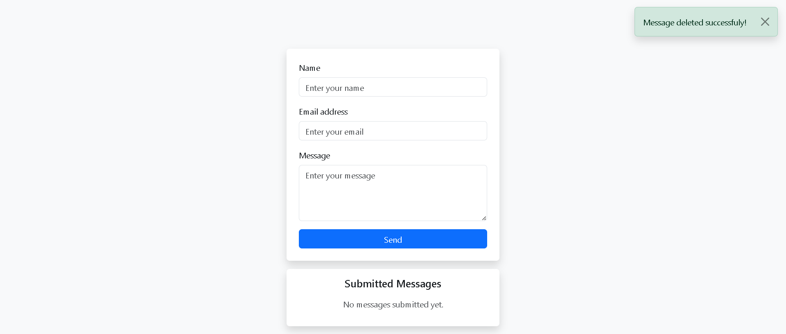
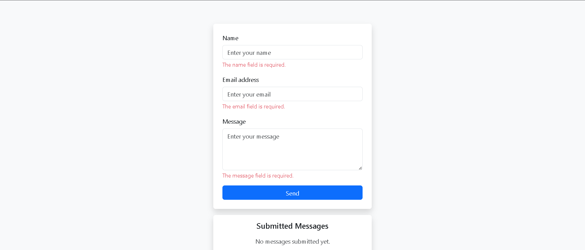

# Project Title

**Brief description:**  
A concise overview of what your project does and the problem it solves.

---

## Table of Contents

- [Project Overview](#project-overview)  
- [Features](#features)  
- [How It Works](#how-it-works)  
- [Screenshots](#screenshots)  
- [Installation](#installation)  
- [Usage](#usage)  
- [Technologies Used](#technologies-used)  
- [Contributing](#contributing)  
- [License](#license)  

---

## Project Overview

This project addresses **[briefly describe the task/problem]** by providing **[solution description]**. The application allows users to **[main functionalities]** efficiently and intuitively.

---

## Features

- **Feature 1:** e.g., Input validation for Student ID to ensure only 8-digit integers.  
- **Feature 2:** Dynamic selection of multiple destination choices with easy add/remove.  
- **Feature 3:** Submit button triggers backend communication and processes data.  
- **Feature 4:** Clear All button to reset input and selections instantly.  
- **Feature 5:** Real-time feedback on user actions with confirmation messages.  
- **Feature 6:** Responsive and user-friendly UI designed with **[your UI framework]**.

---

## How It Works

1. User enters their unique 8-digit Student ID.  
2. User selects one or more destination choices from the dropdown/list.  
3. User clicks **Submit**, which sends the data to the backend for processing using **[technology e.g., Java socket communication]**.  
4. The backend runs the algorithm to determine the optimal final destination.  
5. User receives a confirmation and results displayed on the UI.  
6. **Clear All** resets the form to allow fresh input.

---

## Screenshots

### Main Input Form  
  
*Description: The form for entering Student ID and selecting destinations.*

### Validation Feedback  
  
*Description: Error message if Student ID is invalid.*

### Submission Confirmation  
  
*Description: Confirmation message after successful submission.*

### Final Result Display  
  
*Description: Shows the selected optimal destination after processing.*

### Final Result Display  
  
*Description: Shows the selected optimal destination after processing.*

---

## Installation

1. Clone the repository:  
   ```bash
   git clone https://github.com/Nicatqmov/Andersen-task.git
